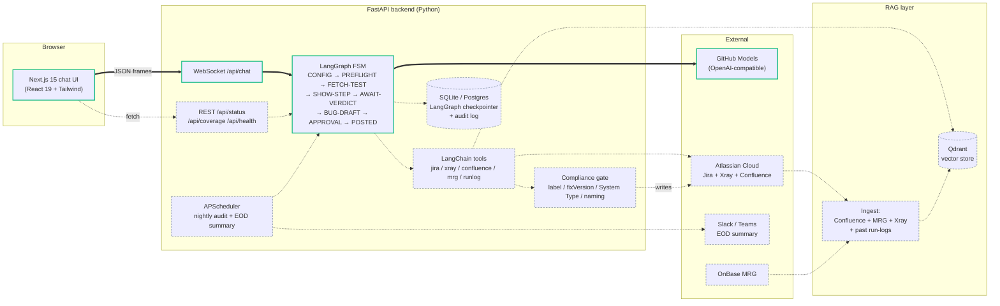
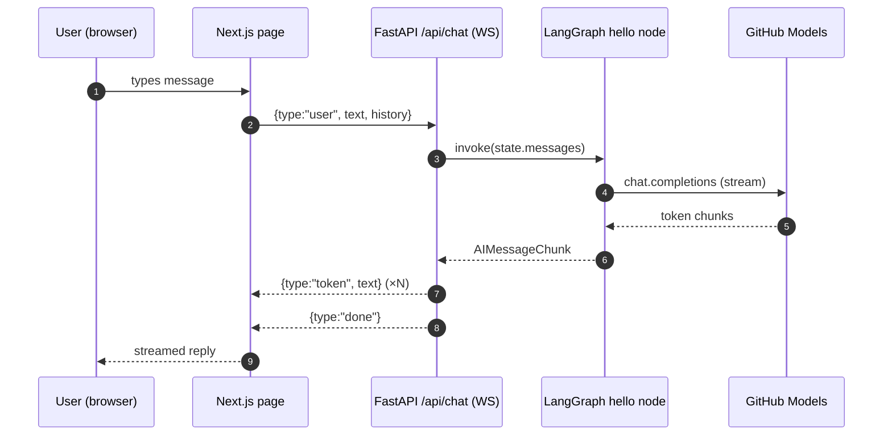
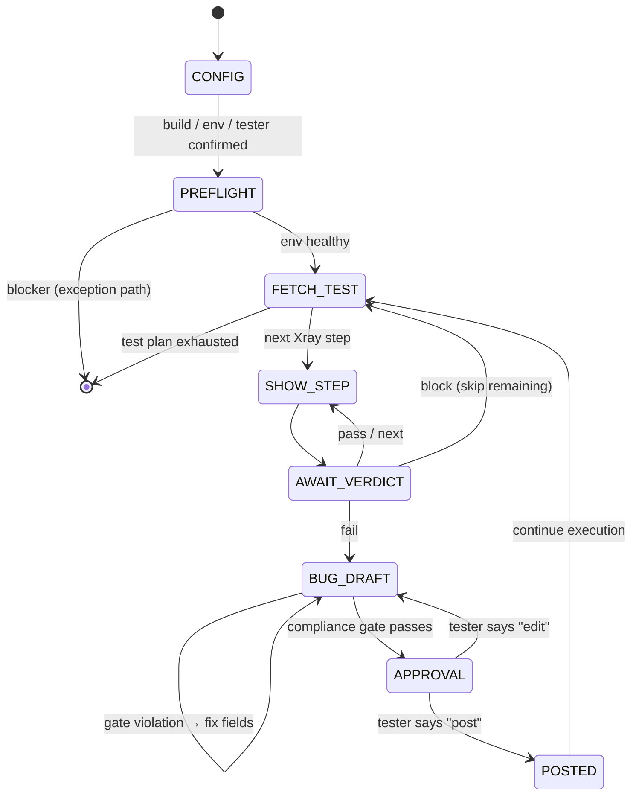

# Regression Agent App

LLM-based regression-testing assistant for the OnBase SBPPA team, anchored on
Jira Xray Test Plan **[SBPPA-14690](https://hyland.atlassian.net/browse/SBPPA-14690)**
("26.1 - Regression - Workflow").

Standalone web app — runs outside VS Code. Same prompts and templates as the
in-editor Copilot agent at [`shibam-dev333/regression-agent`](https://github.com/shibam-dev333/regression-agent),
but with a browser UI, RAG over Confluence + MRG, scheduled jobs, and a real
compliance gate you can unit-test.

## Stack

| Layer | Choice |
|---|---|
| LLM | GitHub Models (`https://models.inference.ai.azure.com`) via OpenAI-compatible API |
| Agent | LangGraph + LangChain (Python) |
| RAG | Qdrant + LangChain vector store |
| Backend | FastAPI + WebSocket |
| Frontend | Next.js 15 (App Router) + TypeScript + Tailwind |
| Session state | SQLite (dev) / Postgres (prod) — LangGraph checkpointer |
| Auth | NextAuth (GitHub OAuth) + Atlassian OAuth 2.0 — *Phase 1+* |

## Architecture

End-state (Phase 6). Solid = wired today (Phase 0). Dashed = arrives in later phases.



### Request path (Phase 0, today)



### Drive loop (Phase 2, planned)



## Status

**Phase 0 — scaffold.** Frontend talks to backend, backend talks to GitHub Models, the
hello LangGraph node returns a streamed completion. No Jira/Xray, no RAG, no auth yet.

See [`docs/BUILD-PLAN.md`](docs/BUILD-PLAN.md) for the full phase plan (0 → 6).

## Quick start (dev)

Prereqs: Python 3.11+ with [uv](https://docs.astral.sh/uv/), Node 20+, pnpm 9+, Docker.

```powershell
# 1. Copy env template and fill in GITHUB_TOKEN (a PAT with models:read scope)
Copy-Item .env.example .env
# Edit .env -> set GITHUB_TOKEN

# 2. Start Qdrant + Postgres (used from Phase 1+; safe to start now)
docker compose up -d

# 3. Backend
cd backend
uv sync
uv run uvicorn app.main:app --reload --port 8000

# 4. Frontend (new terminal)
cd frontend
pnpm install
pnpm dev
```

Open http://localhost:3000 → type a message → it streams back from GitHub Models via
the LangGraph hello node.

## Repo layout

```
regression-agent-app/
  backend/                       FastAPI + LangGraph + LangChain (Python, uv)
    app/
      main.py                    FastAPI entrypoint
      llm.py                     GitHub Models client (OpenAI-compatible)
      graph/
        drive.py                 LangGraph FSM (skeleton in Phase 0, real in Phase 2)
      routes/
        health.py
        chat.py                  WebSocket /api/chat for streaming
      compliance.py              Compliance gate (Phase 3)
      templates/                 Jinja2 templates lifted from sibling repo
    pyproject.toml
    uv.lock
  frontend/                      Next.js 15 + Tailwind (TypeScript, pnpm)
    src/
      app/
        layout.tsx
        page.tsx                 Chat surface (Phase 0)
        api/chat/route.ts        Edge proxy -> backend WS
      components/
      lib/
    package.json
    tsconfig.json
    tailwind.config.ts
  docs/
    BUILD-PLAN.md                Phase 0 -> 6 roadmap
  docker-compose.yml             Qdrant + Postgres for local dev
  .env.example
  .gitignore
  README.md                      this file
```

## License

Internal Hyland use.
